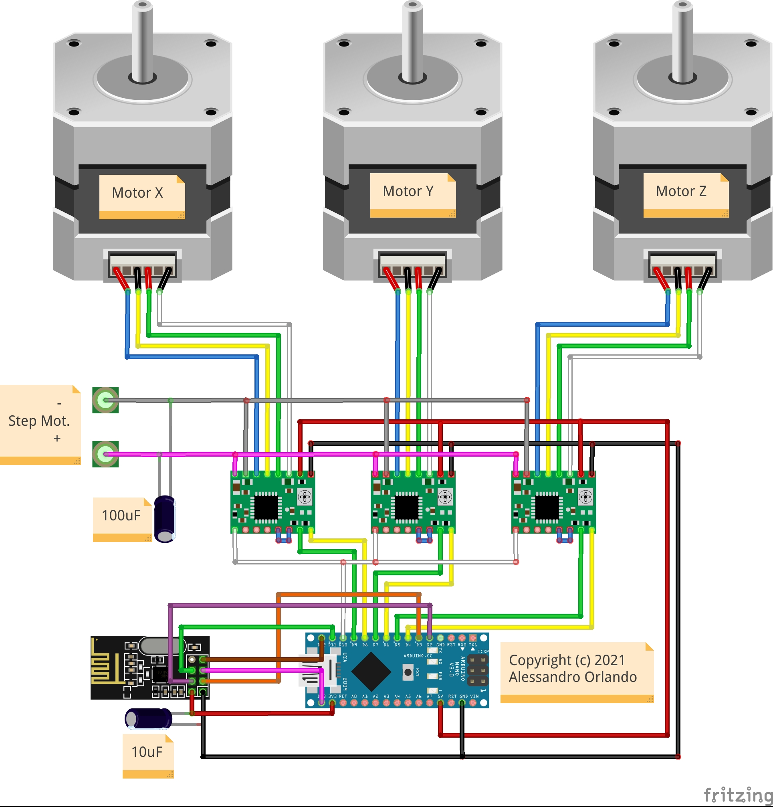

# RX-3-STEP-NANO-24L01

Simple RC receiver built on an Arduino Nano and an nRF24L01 radio module. It listens for packets from the matching transmitter and drives three stepper motors for a motorized slider with pan and tilt.

## How it works

Each loop iteration the radio pipe is checked for incoming data. If a packet is available it is read into the Packet struct, which carries a signed speed and a movement flag for each of the three axes plus a global enable flag. If no data arrives the struct is reset to a safe stopped state, so the motors halt automatically if the transmitter goes out of range.

The `drivemotors` function applies the received values: it sets the stepper driver enable pin according to the enable flag, then either calls `setSpeed` and `run` on each AccelStepper instance or stops it, depending on the corresponding movement flag. A fixed 18 ms delay at the end of each loop gives AccelStepper enough time to step at the commanded speed.

The Packet struct uses `__attribute__((packed))` and `int16_t` speed fields to match the transmitter binary layout exactly and stay within the nRF24L01 32-byte payload limit.

## Hardware

| Component | Pin |
|---|---|
| nRF24L01 CE | D3 |
| nRF24L01 CS | D2 |
| Stepper driver enable | D10 |
| Motor X step / dir | D7 / D6 |
| Motor Y step / dir | D9 / D8 |
| Motor Z step / dir | D5 / D4 |

## Dependencies

- [RF24](https://github.com/nRF24/RF24)
- [AccelStepper](https://github.com/waspinator/AccelStepper)

## License

MIT — see source file header for full text.
